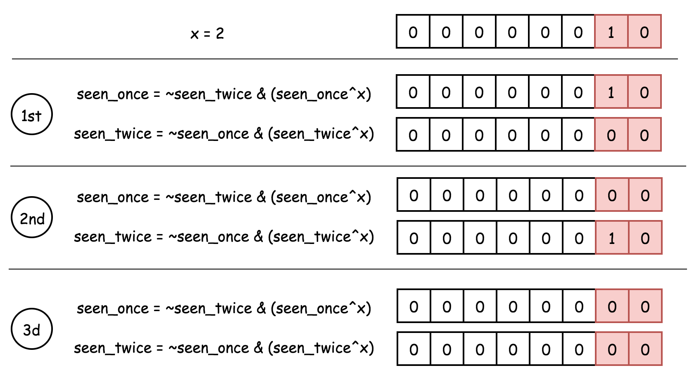

# 只出现一次的数字 II #  
`难度：中等` 

给定一个**非空**整数数组，除了某个元素只出现一次以外，其余每个元素均出现了三次。找出那个只出现了一次的元素。  

**说明**：  
你的算法应该具有线性时间复杂度。 你可以不使用额外空间来实现吗？

**示例 1**:  
**输入**: [2,2,3,2]  
**输出**: 3  

**示例 2**:  
**输入**: [0,1,0,1,0,1,99]  
**输出**: 99  

来源：力扣（LeetCode）  
链接：https://leetcode-cn.com/problems/single-number/  
著作权归领扣网络所有。商业转载请联系官方授权，非商业转载请注明出处。  

---  
>解法一：使用unordered_map记录遍历的数字次数  

```C++  
class Solution {
public:
    int singleNumber(vector<int>& nums) {
        unordered_map<int,int> temp;
        for(int& i : nums) temp[i]++;
        for(int& i : nums)
        {
            if(temp[i] == 1) return i;
        }
        return -1;
    }
};
```  

**执行结果：**  
执行用时 : **12 ms** , 在所有 cpp 提交中击败了 **73.98%** 的用户  
内存消耗 : **12.6 MB** , 在所有 cpp 提交中击败了 **5.53%** 的用户  

---  
>解法二：使用数学公式法(题解)  

```C++  
class Solution {
public:
    int singleNumber(vector<int>& nums) {
        long long num = 0, tmp = 0;
        unordered_set<int> temp;
        for(int& i : nums)
        {
            num += i;
            temp.insert(i);
        }
        for(int i : temp) tmp += i;
        return (3 * tmp - num) / 2;
    }
};
```  

**执行结果：**  
执行用时 : **16 ms** , 在所有 cpp 提交中击败了 **36.24%** 的用户  
内存消耗 : **12.5 MB** , 在所有 cpp 提交中击败了 **5.53%** 的用户  

---  
>解法三：位运算法，分别使用两个数字保存中间结果，具体可参考LeetCode的官方题解配图，此外还可以使用数电中的卡诺图生成最终的位运算表达式(题解)  


```C++  
class Solution {
public:
    int singleNumber(vector<int>& nums) {
        int seen_once = 0, seen_twice = 0;
        for(int i : nums)
        {
            seen_once = (~seen_twice) & (seen_once ^ i);
            seen_twice = (~seen_once) & (seen_twice ^ i);
        }
        return seen_once;
    }
};
```  

**执行结果：**  
执行用时 : **8 ms** , 在所有 cpp 提交中击败了 **95.97%** 的用户  
内存消耗 : **11.7 MB** , 在所有 cpp 提交中击败了 **5.53%** 的用户  

---  
>解法四：统计每一位的1出现个数(题解)  

```C++  
class Solution {
public:
    int singleNumber(vector<int>& nums) {
        int res = 0;
        for(int i = 0; i < 32; ++i)
        {
            int sum = 0;
            for(int j = 0; j < nums.size(); ++j) sum += (nums[j] >> i) & 1;
            res ^= (sum % 3) << i;
        }
        return res;
    }
};
```  

**执行结果：**  
执行用时 : **12 ms** , 在所有 cpp 提交中击败了 **73.98%** 的用户  
内存消耗 : **11.6 MB** , 在所有 cpp 提交中击败了 **5.53%** 的用户  

---  