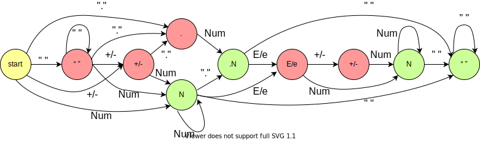

# 表示数值的字符串 #  
`难度：中等` 

请实现一个函数用来判断字符串是否表示数值（包括整数和小数）。例如，字符串"+100"、"5e2"、"-123"、"3.1416"、"-1E-16"、"0123"都表示数值，但"12e"、"1a3.14"、"1.2.3"、"+-5"及"12e+5.4"都不是。

来源：力扣（LeetCode）  
链接：https://leetcode-cn.com/problems/biao-shi-shu-zhi-de-zi-fu-chuan-lcof/  
著作权归领扣网络所有。商业转载请联系官方授权，非商业转载请注明出处。  

---  
>解法一：状态机法，通过遍历字符进行状态转移  

具体的状态转移关系如下所示：  
  
其中如果状态在绿色中结束则表示结果为真

```C++  
class Solution {
public:
    bool isNumber(string s) {
        unordered_map<int, vector<int>> m;
        m[0] = {2, 1, -1, 3, 8};
        m[1] = {-1, -1, -1, 4, -1};
        m[2] = {-1, 1, -1, 3, -1};
        m[3] = {-1, 4, 5, 3, 9};
        m[4] = {-1, -1, 5, 4, 9};
        m[5] = {6, -1, -1, 7, -1};
        m[6] = {-1, -1, -1, 7, -1};
        m[7] = {-1, -1, -1, 7, 9};
        m[8] = {2, 1, -1, 3, 8};
        m[9] = {-1, -1, -1, -1, 9};
        unordered_set<int> res = {3, 4, 7, 9};
        int state = 0;
        for(char ch : s)
        {
            if(state < 0) return false;
            else if(ch == '+' || ch == '-') state = m[state][0];
            else if(ch == '.') state = m[state][1];
            else if(ch == 'E' || ch == 'e') state = m[state][2];
            else if(ch >= '0' && ch <= '9') state = m[state][3];
            else if(ch == ' ') state = m[state][4];
            else state = -1;
        }
        return res.count(state) > 0;
    }
};
```  

**执行结果：**  
执行用时 : **24 ms** , 在所有 cpp 提交中击败了 **10.00%** 的用户  
内存消耗 : **9.2 MB** , 在所有 cpp 提交中击败了 **11.93%** 的用户  

---  
>解法一点五：官方题解的有限状态机 (官方题解一)  

自动机转移过程如图所示  
  

```C++  
class Solution {
private:
    // 10种状态
    enum State {
        STATE_INITIAL,
        STATE_INT_SIGN,
        STATE_INTEGER,
        STATE_POINT,
        STATE_POINT_WITHOUT_INT,
        STATE_FRACTION,
        STATE_EXP,
        STATE_EXP_SIGN,
        STATE_EXP_NUMBER,
        STATE_END,
    };
    // 6种转移方式
    enum CharType {
        CHAR_NUMBER,
        CHAR_EXP,
        CHAR_POINT,
        CHAR_SIGN,
        CHAR_SPACE,
        CHAR_ILLEGAL,
    };
    // 根据字符判断转移状态
    CharType toCharType(char ch) {
        if (ch >= '0' && ch <= '9') {
            return CHAR_NUMBER;
        } else if (ch == 'e' || ch == 'E') {
            return CHAR_EXP;
        } else if (ch == '.') {
            return CHAR_POINT;
        } else if (ch == '+' || ch == '-') {
            return CHAR_SIGN;
        } else if (ch == ' ') {
            return CHAR_SPACE;
        } else {
            return CHAR_ILLEGAL;
        }
    }
public:
    bool isNumber(string s) {
        // 建立状态转移哈希map
        unordered_map<State, unordered_map<CharType, State>> transfer
        {
            {
                STATE_INITIAL, {
                    {CHAR_SPACE, STATE_INITIAL},
                    {CHAR_NUMBER, STATE_INTEGER},
                    {CHAR_POINT, STATE_POINT_WITHOUT_INT},
                    {CHAR_SIGN, STATE_INT_SIGN},
                }
            }, {
                STATE_INT_SIGN, {
                    {CHAR_NUMBER, STATE_INTEGER},
                    {CHAR_POINT, STATE_POINT_WITHOUT_INT},
                }
            }, {
                STATE_INTEGER, {
                    {CHAR_NUMBER, STATE_INTEGER},
                    {CHAR_EXP, STATE_EXP},
                    {CHAR_POINT, STATE_POINT},
                    {CHAR_SPACE, STATE_END},
                }
            }, {
                STATE_POINT, {
                    {CHAR_NUMBER, STATE_FRACTION},
                    {CHAR_EXP, STATE_EXP},
                    {CHAR_SPACE, STATE_END},
                }
            }, {
                STATE_POINT_WITHOUT_INT, {
                    {CHAR_NUMBER, STATE_FRACTION},
                }
            }, {
                STATE_FRACTION,
                {
                    {CHAR_NUMBER, STATE_FRACTION},
                    {CHAR_EXP, STATE_EXP},
                    {CHAR_SPACE, STATE_END},
                }
            }, {
                STATE_EXP,
                {
                    {CHAR_NUMBER, STATE_EXP_NUMBER},
                    {CHAR_SIGN, STATE_EXP_SIGN},
                }
            }, {
                STATE_EXP_SIGN, {
                    {CHAR_NUMBER, STATE_EXP_NUMBER},
                }
            }, {
                STATE_EXP_NUMBER, {
                    {CHAR_NUMBER, STATE_EXP_NUMBER},
                    {CHAR_SPACE, STATE_END},
                }
            }, {
                STATE_END, {
                    {CHAR_SPACE, STATE_END},
                }
            }
        };
        // 初始化状态，逐个元素遍历判断状态转移
        State st = STATE_INITIAL;
        for(int i = 0; i < s.length(); ++i)
        {
            CharType typ = toCharType(s[i]);
            if(transfer[st].find(typ) == transfer[st].end()) return false;
            else st = transfer[st][typ];
        }
        return st == STATE_INTEGER || st == STATE_POINT || st == STATE_FRACTION || st == STATE_EXP_NUMBER || st == STATE_END;
    }
};
```

**执行结果：**  
执行用时 : **72 ms** , 在所有 cpp 提交中击败了 **6.05%** 的用户  
内存消耗 : **15.6 MB** , 在所有 cpp 提交中击败了 **5.06%** 的用户  

---  